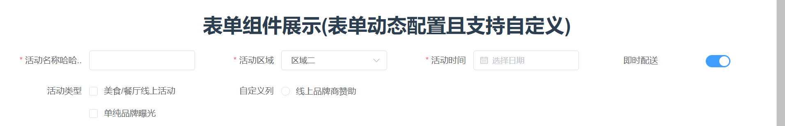

# vue-ele-project

## Project setup

```
yarn install
```

### Compiles and hot-reloads for development

```
yarn dev
```

### Compiles and minifies for production

```
yarn build
```

### 发布 npm 库之前需要先执行

```
yarn lib

### Lints and fixes files
```

yarn lint

```

### Customize configuration
See [Configuration Reference](https://cli.vuejs.org/config/).
```

### vue-ele-project 使用教程 

```
main.js 引入
    import vueEleProject from "vue-ele-project";
    Vue.use(vueEleProject);
```

### buttonList 使用教程 按钮组件展示(支持element-ui的所有button属性)


```
    <buttonList :buttonList="buttonList" size="medium"></buttonList>
    data() {
      return {
        buttonList: [
          {
            name: '默认按钮',
            color: 'red',//自定义颜色
            type: '',//指出所有饿了么的按钮属性
            click: ({ item, index }) => { // 按钮点击事件
              console.log(item, index)
            },
          },
          {
            name: '主要按钮',
            type: 'primary',
            disabled: true,
            icon: 'el-icon-arrow-left',
            click: ({ item, index }) => {
              console.log(item, index)
            },
          },
          {
            name: '成功按钮',
            type: 'success',
            click: ({ item, index }) => {
              console.log(item, index)
            },
          },
          {
            name: '信息按钮',
            type: 'info',
            click: ({ item, index }) => {
              console.log(item, index)
            },
          },
          {
            name: '信息按钮',
            type: 'warning',
            click: ({ item, index }) => {
              console.log(item, index)
            },
          },
          {
            name: '危险按钮',
            type: 'danger',
            click: ({ item, index }) => {
              console.log(item, index)
            },
          },
        ],
      }
    },
```

### Table 使用教程 表格组件展示(支持element-ui table的所有属性事件)


```
     <Table
          class="custom-table"
          :data="tableData"
          :columns="columns"
          size="mini"
          showIndex
          showSelection
          :header-cell-style="
            () => {
              return {
                background: 'rgb(238, 239, 243)',
                'text-align': 'center',
                'font-size': '14px',
                color: 'rgb(80, 80, 80)',
              }
            }
          "
          :cell-style="
            () => {
              return {
                padding: '2px',
                'text-align': 'center',
              }
            }
          "
        >
          <template v-slot:action="{ row, $index }">
            <el-form-item>
              <el-link
                type="primary"
                :underline="false"
                @click="editRow(row, $index)"
                >修改</el-link
              >
              &nbsp;&nbsp;
              <el-link
                type="primary"
                :underline="false"
                @click="deleteRow(row, $index)"
                >删除</el-link
              >
            </el-form-item>
          </template>
          <template v-slot:number="{ row }">
            <el-form-item>
              <el-input v-model="row.number"></el-input>
            </el-form-item>
          </template>
          <template v-slot:select="{ row }">
            <el-form-item>
              <el-select v-model="row.select" placeholder="请选择">
                <el-option
                  v-for="item in selectOptions"
                  :key="item.value"
                  :label="item.label"
                  :value="item.value"
                >
                </el-option>
              </el-select>
            </el-form-item>
          </template>
          <template v-slot:cascader="{ row }">
            <el-form-item>
              <el-cascader
                v-model="row.cascader"
                :options="cascaderOptions"
                @change="handleChange"
              ></el-cascader>
            </el-form-item>
          </template>
        </Table>


      data() {
        return {
          columns: [
            { defaultSlot: 'action', label: '操作' },
            { prop: 'date', label: '日期', width: 200 },
            { prop: 'name', label: '姓名', width: 180 },
            { prop: 'address', label: '地址' },
            { defaultSlot: 'number', label: '输入框' },
            { defaultSlot: 'select', label: '下拉框' },
            { defaultSlot: 'cascader', label: '级联选择框' },
          ],
          tableData: [
            {
              date: '2016-05-02',
              name: '王小虎',
              address: '上海市普陀区金沙江路 1518 弄',
            },
            {
              date: '2016-05-04',
              name: '王小虎',
              address: '上海市普陀区金沙江路 1517 弄',
            },
            {
              date: '2016-05-01',
              name: '王小虎',
              address: '上海市普陀区金沙江路 1519 弄',
            },
            {
              date: '2016-05-03',
              name: '王小虎',
              address: '上海市普陀区金沙江路 1516 弄',
            },
          ],
        }
      },
```

### Form 使用教程 表单组件展示(表单动态配置且支持自定义)

```
   <Form
      class="custom-form"
      :rules="formRules"
      :model="form"
      :form.sync="form"
      label-width="140px"
      :formList="formList"
      size="small"
      ref="form"
      :columns="4"
    >
      <template v-slot:type="{}">
        <!-- v-slot:type="{ label, defaultSlot } -->
        <el-col :span="6">
          <el-checkbox-group v-model="form.type">
            <el-checkbox label="美食/餐厅线上活动" name="type"></el-checkbox>
            <el-checkbox label="单纯品牌曝光" name="type"></el-checkbox>
          </el-checkbox-group>
        </el-col>
      </template>
      <template v-slot:custom="{}">
        <!-- v-slot:type="{ label, defaultSlot } -->
        <el-col :span="6">
          <el-radio-group v-model="form.resource">
            <el-radio label="线上品牌商赞助"></el-radio>
          </el-radio-group>
        </el-col>
      </template>
    </Form>
    data() {
      return {
        form: {
          name: '',
          date1: '',
          delivery: true,
          type: [],
          resource: '',
        },
        formList: [
          { label: '活动名称哈哈哈', prop: 'name', type: 'input' },
          {
            label: '活动区域',
            prop: 'region',
            type: 'select',
            selectObject: {
              labelKey: 'label',
              valueKey: 'value',
              options: [
                { label: '区域二', value: 'beijing' },
                { label: '区域三', value: 'shanghai' },
              ],
            },
          },
          { label: '活动时间', prop: 'date1', type: 'date' },
          { label: '即时配送', prop: 'delivery', type: 'switch' },
          { defaultSlot: 'type', label: '活动类型' },
          { defaultSlot: 'custom', label: '自定义列' },
        ],
        formRules: {
          name: [
            { required: true, message: '请输入活动名称', trigger: 'blur' },
            { min: 3, max: 5, message: '长度在 3 到 5 个字符', trigger: 'blur' },
          ],
          region: [
            { required: true, message: '请选择活动区域', trigger: 'change' },
          ],
          date1: [
            {
              type: 'date',
              required: true,
              message: '请选择日期',
              trigger: 'change',
            },
          ],
          type: [
            {
              type: 'array',
              required: true,
              message: '请至少选择一个活动性质',
              trigger: 'change',
            },
          ],
          resource: [
            { required: true, message: '请选择活动资源', trigger: 'change' },
          ],
          desc: [{ required: true, message: '请填写活动形式', trigger: 'blur' }],
        },
    }
  },
```