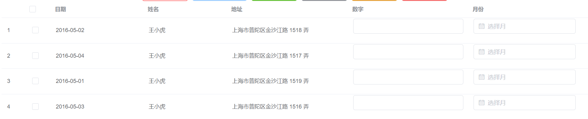

# project

## Project setup

```
yarn install
```

### Compiles and hot-reloads for development

```
yarn dev
```

### Compiles and minifies for production

```
yarn build
```

### 发布 npm 库之前需要先执行

```
yarn lib

### Lints and fixes files
```

yarn lint

```

### Customize configuration
See [Configuration Reference](https://cli.vuejs.org/config/).
```

### vue-ele-project 使用教程

```
main.js 引入
    import vueEleProject from "vue-ele-project";
    Vue.use(vueEleProject);
```

### buttonList 使用教程


```
    <buttonList :buttonList="buttonList" size="medium"></buttonList>
    data() {
    return {
      buttonList: [
        {
          name: '默认按钮',
          color: 'red',//自定义颜色
          type: '',//指出所有饿了么的按钮属性
          click: ({ item, index }) => { // 按钮点击事件
            console.log(item, index)
          },
        },
        {
          name: '主要按钮',
          type: 'primary',
          disabled: true,
          icon: 'el-icon-arrow-left',
          click: ({ item, index }) => {
            console.log(item, index)
          },
        },
        {
          name: '成功按钮',
          type: 'success',
          click: ({ item, index }) => {
            console.log(item, index)
          },
        },
        {
          name: '信息按钮',
          type: 'info',
          click: ({ item, index }) => {
            console.log(item, index)
          },
        },
        {
          name: '信息按钮',
          type: 'warning',
          click: ({ item, index }) => {
            console.log(item, index)
          },
        },
        {
          name: '危险按钮',
          type: 'danger',
          click: ({ item, index }) => {
            console.log(item, index)
          },
        },
      ],
    }
  },
```

### Table 使用教程



```
    <Table
        :data="tableData"
        :columns="columns"
        size="mini"
        showIndex
        showSelection
        :cell-style="
          () => {
            return {
              padding: '2px',
            }
          }
        "
      >
        <template v-slot:number="{ row }">
          <el-form-item>
            <el-input v-model="row.number"></el-input>
          </el-form-item> </template
        ><template v-slot:month="{ row }">
          <el-form-item>
            <el-date-picker
              v-model="row.month"
              type="month"
              placeholder="选择月"
            >
            </el-date-picker>
          </el-form-item>
        </template> </Table
    >


      data() {
        return {
          columns: [
            { prop: 'date', label: '日期', width: 200 },
            { prop: 'name', label: '姓名', width: 180 },
            { prop: 'address', label: '地址' },
            { defaultSlot: 'number', label: '数字' },
            { defaultSlot: 'month', label: '月份' },
          ],
          tableData: [
            {
              date: '2016-05-02',
              name: '王小虎',
              address: '上海市普陀区金沙江路 1518 弄',
            },
            {
              date: '2016-05-04',
              name: '王小虎',
              address: '上海市普陀区金沙江路 1517 弄',
            },
            {
              date: '2016-05-01',
              name: '王小虎',
              address: '上海市普陀区金沙江路 1519 弄',
            },
            {
              date: '2016-05-03',
              name: '王小虎',
              address: '上海市普陀区金沙江路 1516 弄',
            },
          ],
        }
      },
```
